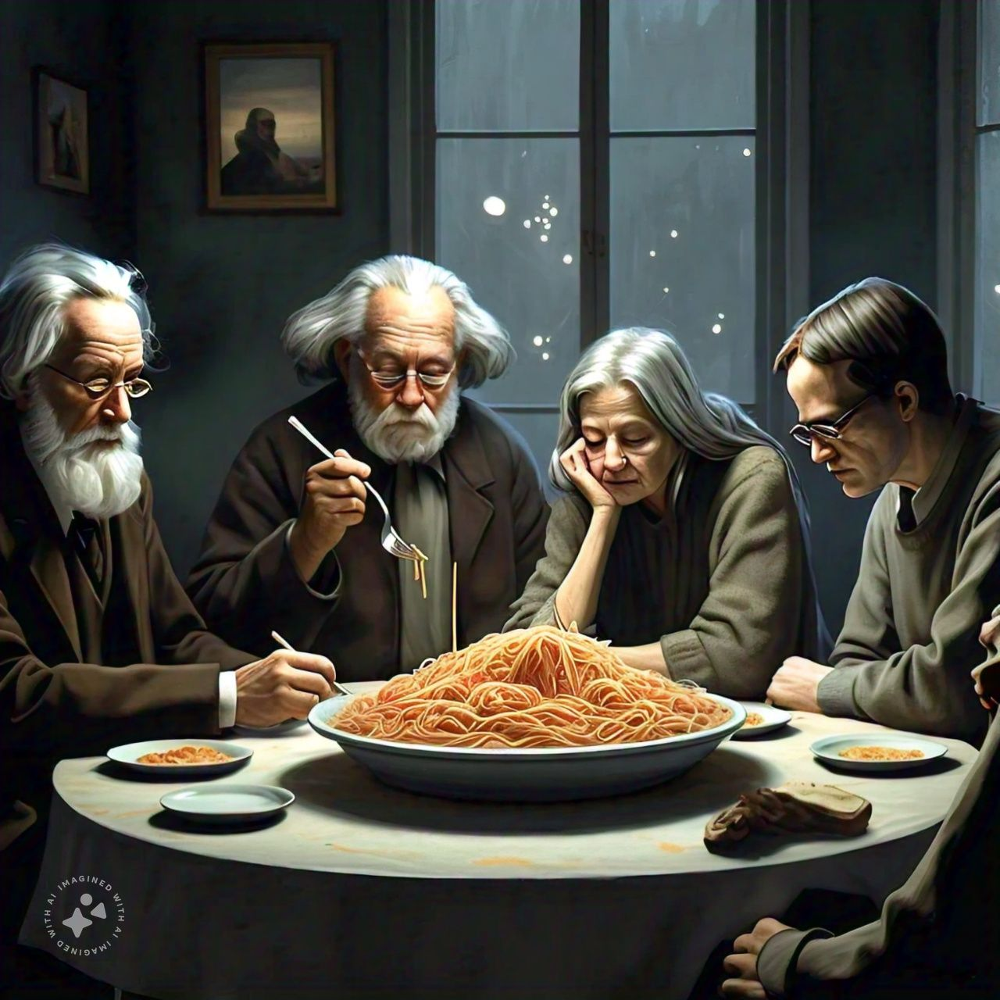

# Philosophers - 42School Project
El proyecto Philosophers simula el clásico problema de *"la cena de los filósofos"* (*dining philosophers problem*) para aprender conceptos clave de concurrencia, sincronización y gestión de recursos en sistemas operativos. A través de la interacción entre hilos que compiten por recursos limitados (*tenedores*), se debe resolver problemas de *"condiciones de carrera"* (*data races*) y evitar bloqueos (*deadlocks*).

## Descripción General
- Los filósofos alternan entre comer, pensar y dormir, pero solo pueden comer cuando tienen dos tenedores (uno en cada mano).
- La simulación termina cuando un filósofo muere de hambre o cuando todos han comido un número determinado de veces (opcional).
- Se deben gestionar los tiempos de cada acción y evitar que los filósofos mueran debido a la falta de comida.

## Instrucciones de Compilación
El proyecto incluye un Makefile con las siguientes reglas:
- `make all`: Compila el proyecto.
- `make clean`: Elimina archivos objeto.
- `make fclean`: Elimina los ejecutables y archivos objeto.
- `make re`: Limpia y recompila todo el proyecto.
- 
## Uso
Descarga el repositorio y dentro del directorio compila el proyecto:
```bash
make
```
Esto genera un binario `philo` y requiere los siguientes argumentos:
```bash
./philo number_of_philosophers time_to_die time_to_eat time_to_sleep [number_of_times_each_philosopher_must_eat]
```
Donde `number_of_philosophers` es la cantidad de filósofos, `time_to_die` `time_to_eat` `time_to_sleep` son tiempos en milisegundos y `[number_of_times_each_philosopher_must_eat]` es opcional e indica el número de comidas que debe alcanzar cada filósofo para completar la simulación.

### Licencia
Este proyecto es parte del currículo de 42School y está sujeto a sus términos de uso y condiciones.
